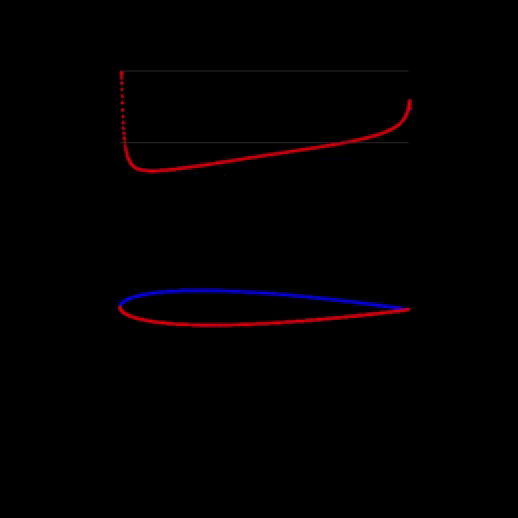
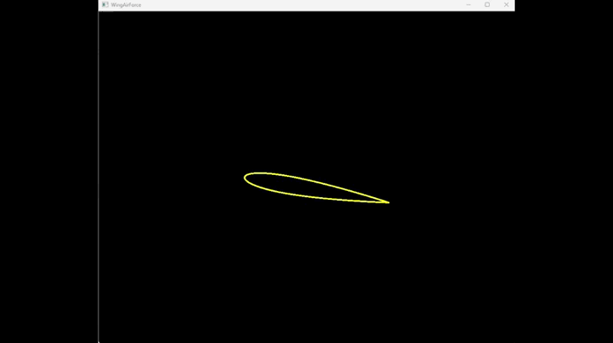
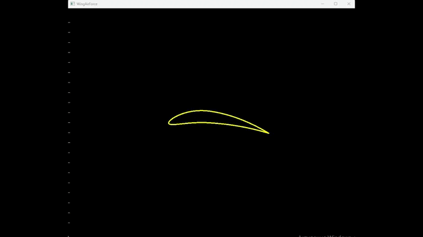

# **Vortex Panel Method**

## **Описание проекта**

Этот проект представляет собой реализацию метода дискретных вихрей для анализа аэродинамики профиля крыла. Программа позволяет:

- **Визуализировать линии тока** для профиля крыла.
- Построить **графики распределения давлений** на верхней и нижней поверхностях.
- Вычислить **подъёмную силу** крыла для различных профилей, используя циркуляцию.

Метод дискретных вихрей — это численный подход, который моделирует обтекание профиля крыла, заменяя непрерывное распределение вихрей системой точечных вихрей, размещённых вдоль профиля. 

## **Основные функции**

### 1. Построение линий тока
- Линии тока визуализируют поток воздуха вокруг крыла и помогают понять особенности обтекания.

### 2. Графики распределения давления
- Программа строит графики изменения давления на верхней и нижней поверхностях профиля, демонстрируя аэродинамические свойства.

### 3. Подъёмная сила
- Расчёт безразмерного коэффициента подъёмной силы $C_L$ проводится через циркуляцию, используя теорему Жуковского:
$$C_L = 2*Gamma/(V*S)$$
- $V$ — скорость потока,
- $S$ — площадь крыла,
- $Gamma$ — циркуляция, рассчитываемая по интенсивностям вихрей.

## **Технологии**
 - Язык: C++
 - Библиотеки:
   - **SFML** для визуализации,
   - **Eigen** для работы с линейной алгеброй.  

## **Примеры**

